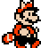

# Mario Walk

Mario version Mario Bros. 1 qui marche ou Mario version Tanuki de Mario Bros. 3.
## Description

## Comment l'utiliser sous OBS Studio

Pour utiliser cette animation, suivez les étapes suivantes :

- Installer le dossier **mario-walk** quelque part sur votre ordinateur.
- Dans votre scène ajoutez une nouvelle source de type "_navigateur_".
- Dans les paramètres de la source, cochez "Fichier local" et dans le 
champ "_URL_" entrez le chemin du fichier, par exemple : `c:/mon-dossier/mario-walk.html`.
- Dans le champ "Largeur", mettre "1920"
- Pour que l'animation se réinitialise à chaque fois que vous activez
  la source, il faut cocher l'option "_Rafraîchir le navigateur lorsque la scène
  devient active_".

## Sources

Fichier gif disponible sur [gifer](https://gifer.com/)