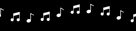

# Bandeau note à musique

## Description

## Comment l'utiliser sous OBS Studio

Pour utiliser le compte à rebours, suivez les étapes suivantes :

- Installer le dossier **bouncing-notes** quelque part sur votre ordinateur.
- Dans votre scène ajoutez une nouvelle source de type "_navigateur_".
- Dans les paramètres de la source, cochez "Fichier local" et dans le 
champ "_URL_" entrez le chemin du fichier, par exemple : `c:/mon-dossier/bouncing-notes.html`.
- Dans le champ "Largeur", mettre "1920"
- Dans le champ "Hauteur", mettre "60"
- Pour que le compte à rebours se réinitialise à chaque fois que vous activez
  la source, il faut cocher l'option "_Rafraîchir le navigateur lorsque la scène
  devient active_".

## Sources

Icônes note-double.png conçues par [rukanicon](https://www.flaticon.com/fr/auteurs/rukanicon)

Icônes note-simple.png conçues par [IYAHICON](https://www.flaticon.com/fr/auteurs/iyahicon)

Ces deux icônes ont été mise en blanc par mes soins.