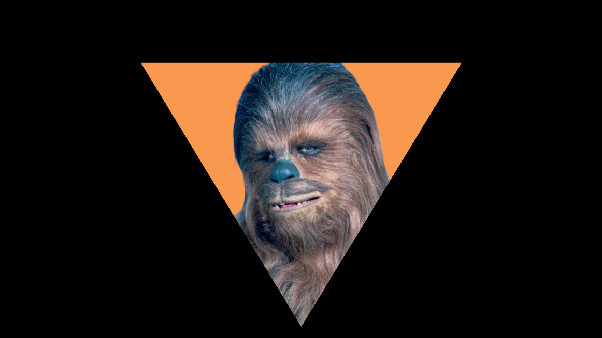

# Triangle pointe en bas - webcam mask

## Description

Parfait pour des lives rétro

## Comment l'utiliser sous OBS Studio

Pour utiliser le masque en tant que filtre sur votre webcam : 

- Installer le fichier **triangle-point-down.png** quelque part sur 
votre ordinateur.
- Faites un clique droit sur votre source webcam et sélectionnez "_filtres_".
- Dans la section "_Filtres d'effets_" cliquez sur l'icone "_+_" et sélectionnez
"_Masque d'image/mélange_".
- Donnez un nom à votre filtre, par exemple "_Mask triangle_".
- Dans le champ "_type_", sélectionnez "_"Masque alpha (canal alpha)_".
- Dans le champ "_Chemin d'accés_", sélectionnez le fichier installé plus haut.

Et voilà, votre webcam n'affiche que la zone définie par le masque.